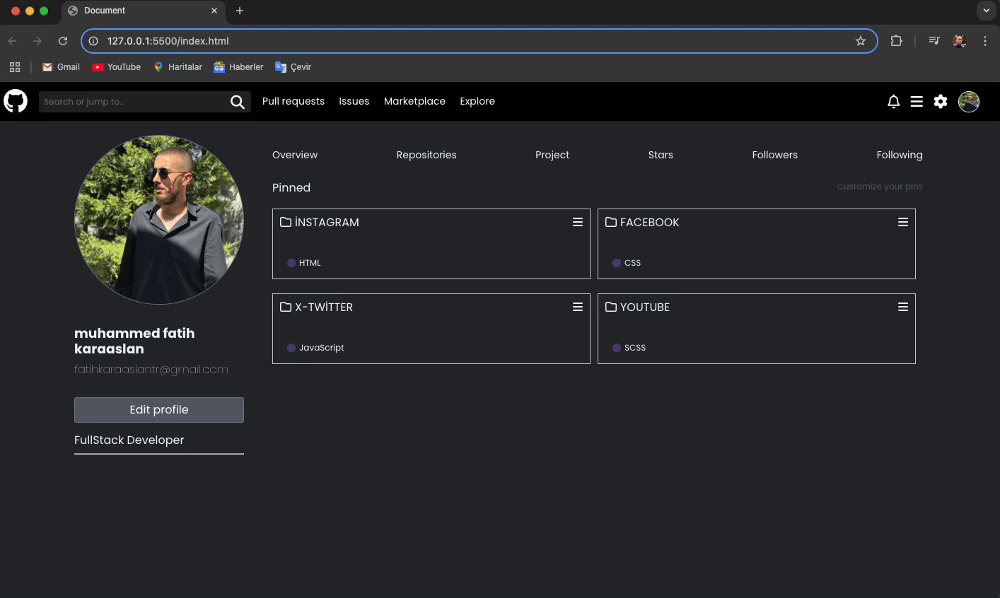

<h1>🚀 github Clone Web Site Arayüzü</h1>

Bu proje, GitHub'ın minimalist ve temel bir klonudur. Bu projede, GitHub'ın anasayfasının görsel yapısı ve tasarımı basitleştirilmiş bir şekilde yeniden yaratılmıştır.

<h2>🛠️ Kullanılan Teknolojiler</h2>

-Html
-Css
-Scss

<h2>⚙️ Amaç</h2>

Bu proje, web tasarım becerilerimi geliştirmek ve HTML/CSS/SCSS kullanarak popüler web sitelerinin temel yapılarını öğrenmek için oluşturulmuştur. Yeni başlayanlar için de bir referans projesi olabilir.

<h6>Kullanıcı Odaklı Stil:</h6>

Minimalist ve Düzenli Arayüz: Kullanıcıların ürün arama ve inceleme işlemlerini kolaylaştırır.
Temiz Renk Paleti: sade ve profesyonel tarzını yansıtan renkler seçilmiştir.

<h1>🎬 Ekran Görüntüsü</h1>

